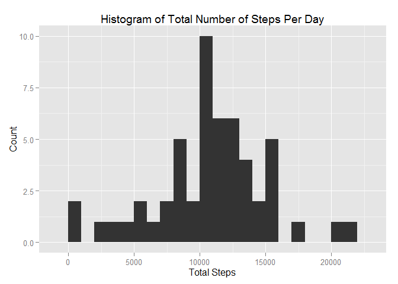
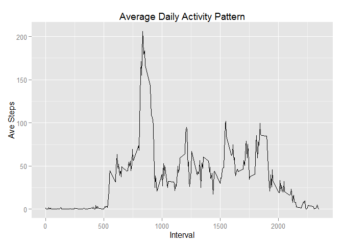
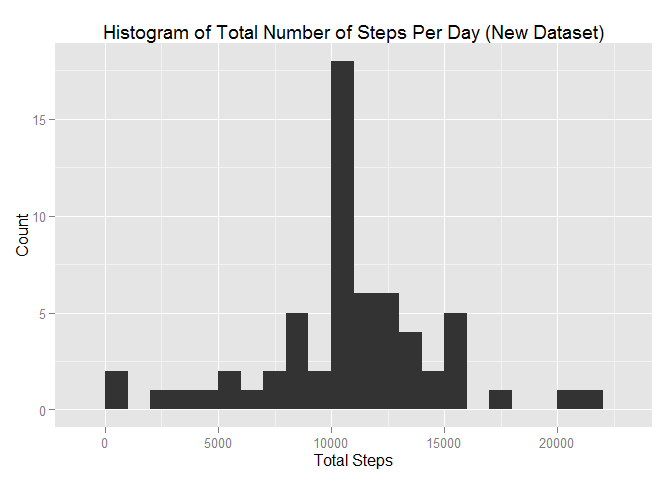
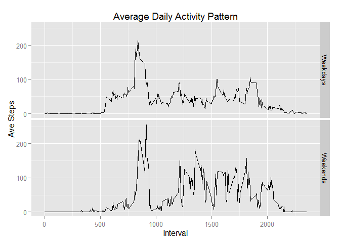

# Reproducible Research: Peer Assessment 1


## Loading and preprocessing the data

The below code downloads and unzips the data file if it is not already on the working directory. It also loads packages which will be used throughout the analysis.


```r
#Load packages
if("data.table" %in% rownames(installed.packages()) == FALSE) 
        {install.packages("data.table")}

if("dplyr" %in% rownames(installed.packages()) == FALSE) 
        {install.packages("dplyr")}

if("ggplot2" %in% rownames(installed.packages()) == FALSE) 
        {install.packages("ggplot2")}

suppressMessages(library(data.table))
```

```
## Warning: package 'data.table' was built under R version 3.1.3
```

```r
suppressMessages(library(dplyr))
```

```
## Warning: package 'dplyr' was built under R version 3.1.3
```

```r
suppressMessages(library(ggplot2))
```

```
## Warning: package 'ggplot2' was built under R version 3.1.3
```

```r
#Get data
fileUrl <- "https://d396qusza40orc.cloudfront.net/repdata%2Fdata%2Factivity.zip"
if(!file.exists("./activity.zip")){download.file(fileUrl,destfile="./activity.zip")}
if(!file.exists("./activity.csv")){unzip(zipfile="./activity.zip")}

activity <- read.csv("./activity.csv", colClasses = c("integer", "Date", "integer"))
```

The next chunk of code converts the data frame into a data table and removes missing values.


```r
activity <- data.table(activity)

activity_clean <- na.omit(activity)
```

## What is mean total number of steps taken per day?

The below code calculates the numer of steps taken per day and then creates a histogram.


```r
steps_per_day <- summarise(group_by(activity_clean, date), total_steps=sum(steps))

ggplot(steps_per_day) + aes(x=total_steps) + geom_histogram(binwidth=1000) + labs(title="Histogram of Total Number of Steps Per Day", x = "Total Steps", y = "Count")
```

 

The next piece of code calculates and the mean and median of the total number of steps taken per day.


```r
mean <- as.integer(mean(steps_per_day$total_steps))
median <- median(steps_per_day$total_steps)
```

The mean of the total number of steps taken per day is 10766

The median of the total number of steps taken per day is 10765 

## What is the average daily activity pattern?

The code chunk below calculates the average daily activity pattern and plots it on a line chart.


```r
pattern <- summarise(group_by(activity_clean, interval), ave_steps=mean(steps))

ggplot(pattern) + aes(x=interval, y=ave_steps) + geom_line() + labs(title="Average Daily Activity Pattern", x = "Interval", y = "Ave Steps")
```

 

The next code chunk finds the interval with the highest average steps.


```r
mx = max(pattern$ave_steps)
int = pattern[ave_steps == mx]
stps = as.integer(int$ave_steps)
int = int$interval
```

The interval with the most activity is 835 with 206 steps.

## Imputing missing values

The below code chunk calculates the amount of missing values in the data set.


```r
nas <- sum(is.na(activity$steps))
```

There are 2304 missing values in the dataset.

The following code creates a new data set replacing missing values with the average of the relative interval.


```r
activity2 <- activity 
for (i in 1:nrow(activity2)) {
    if (is.na(activity2$steps[i])) {
        activity2$steps[i] <- as.integer(pattern[which(activity2$interval[i] == pattern$interval), ]$ave_steps)
    }
}
```

The next piece of code re-calculates the total amount of steps per day and recreates the histogram with the new data set.


```r
steps_per_day2 <- summarise(group_by(activity2, date), total_steps=sum(steps))

ggplot(steps_per_day2) + aes(x=total_steps) + geom_histogram(binwidth=1000) + labs(title="Histogram of Total Number of Steps Per Day (New Dataset)", x = "Total Steps", y = "Count")
```

 

The next piece of code calculates and the mean and median of the total number of steps taken per day with the new data set.


```r
mean2 <- as.integer(mean(steps_per_day2$total_steps))
median2 <- median(steps_per_day2$total_steps)
```

The mean of the total number of steps taken per day with the new data set is 10749

The median of the total number of steps taken per day with the new data set is 10641 

These are lower than the mean and median from the original dataset.

## Are there differences in activity patterns between weekdays and weekends?

The next code chunk identifies weekends and weekdays.


```r
activity2 <- mutate(activity2, day = weekdays(date))
activity2 <- mutate(activity2, weekday = ifelse(day == "Saturday" | day == "Saturday", "Weekend", "Weekday"))
```

The code chunk below calculates the average daily activity pattern and plots it on a line chart for weekdays and weekends.


```r
pattern2 <- summarise(group_by(activity2, interval, weekday), ave_steps=mean(steps))

ggplot(pattern2) + aes(x=interval, y=ave_steps) + geom_line() + labs(title="Average Daily Activity Pattern", x = "Interval", y = "Ave Steps") + facet_grid(. ~ weekday)
```

 
